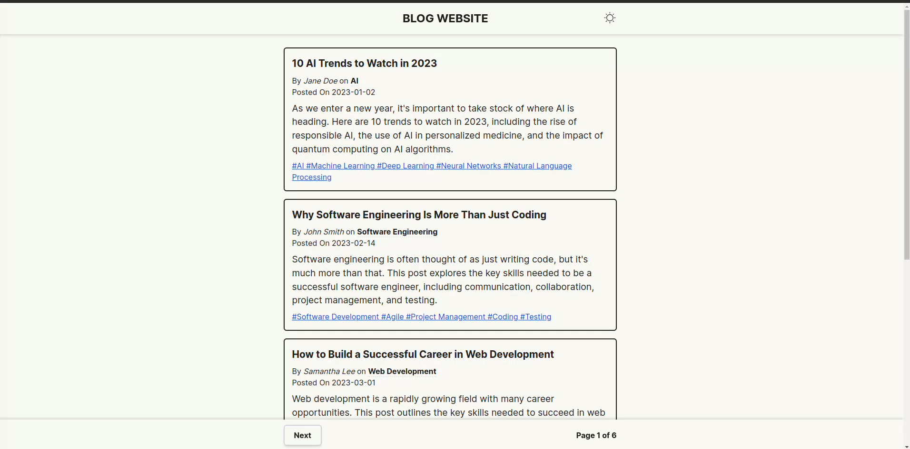

# Project Name

Blog Website

## Description

This website is made using ReactJs and tailwind. It is a responsive blog website , the data of the blog is being fetched from an API. I have used context to create a centralized data that child components of App.js can access.

## Preview

## Contact

LinkedIn: www.linkedin.com/in/rishabkumarjha
Mail: kumarjharishab@gmail.com